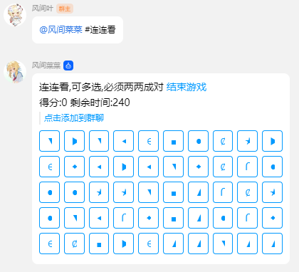
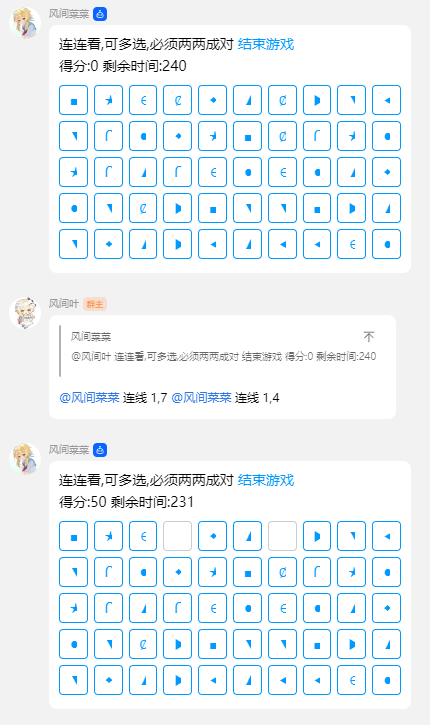
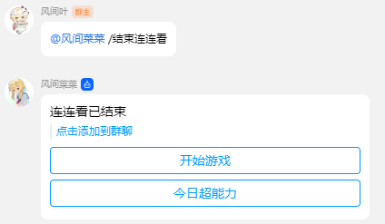

# 连连看

## 介绍

使用按钮进行交互, 两个图像直接可以拐两次弯

## 指令

| 指令       | 用途     | 示例              | 备注         |
| ---------- | -------- | ----------------- | ------------ |
| 连连看     | 开始游戏 | #连连看           |              |
| 连线       | 选择天赋 | 连线 1,1 连线 1,2 | 必须要两个值 |
| 结束连连看 | 结束游戏 | #结束连连看       |              |

## 注意事项

- 连线必须要有两个值
- 一条消息选择多个时会收不到这条消息

## 配置文件

如果有的话

## 鸣谢

- [zhanyuzhang/link-game](https://github.com/zhanyuzhang/link-game) H5 消消乐（连连看）小游戏

## 效果图

### 开始游戏

### 进行游戏

### 结束游戏

