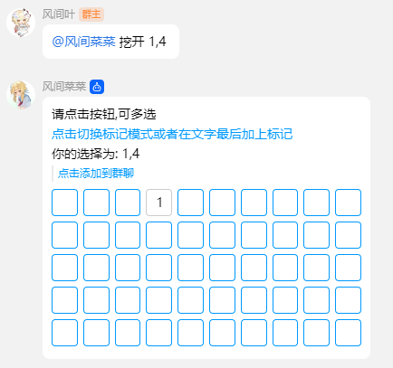

# 扫雷

## 介绍

通过按钮点击来进行扫雷游戏,最大支持 5\*10

## 指令

| 指令  | 用途     | 示例          | 备注               |
| ----- | -------- | ------------- | ------------------ |
| #扫雷 | 开始游戏 | #扫雷         |                    |
| 挖开  | 进行游戏 | 挖开 1,1      |                    |
| 标记  | 标记格子 | 挖开 1,1 标记 | 需要和挖开一起使用 |

## 注意事项

- 一般来说只能点击按钮进行操作,所以没有支持`标记 x,y`这样的指令
- 在`PCQQNT`可能会显示不全

## 配置文件

如果有的话

## 鸣谢

- [noneplugin/nonebot-plugin-minesweeper](https://github.com/noneplugin/nonebot-plugin-minesweeper) Nonebot2 扫雷插件

## 效果图

### 开始游戏

### 进行游戏

### 标记

