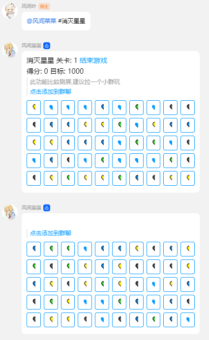
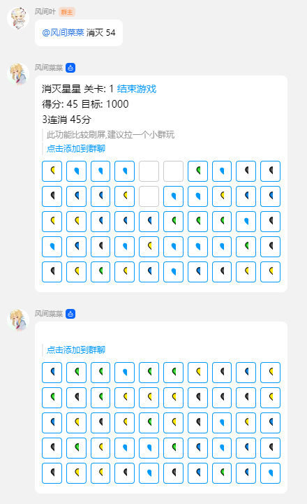
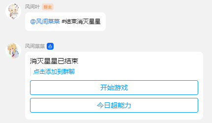

# 消灭星星

## 介绍

通过按钮交互, 实现经典小游戏《消灭星星》

## 指令

| 指令         | 用途     | 示例          | 备注 |
| ------------ | -------- | ------------- | ---- |
| 消灭星星     | 开始游戏 | #消灭星星     |      |
| 消灭         | 进行游戏 | 消灭 1        |      |
| 结束消灭星星 | 结束游戏 | #结束消灭星星 |      |

## 注意事项

- 因为消灭星星为 10\*10,所以会发送两排按钮
- 在`PCQQNT`可能会显示不全

## 配置文件

如果有的话

## 鸣谢

- [leeenx/popstar](https://github.com/leeenx/popstar) H5 小游戏 100 例：消灭星星

## 效果图

### 开始游戏

### 进行游戏

### 结束游戏

