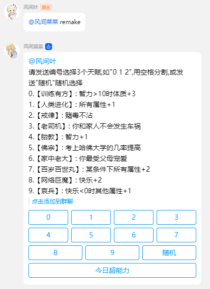
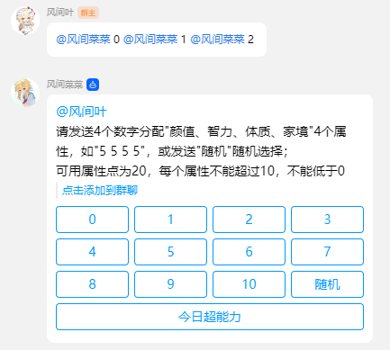
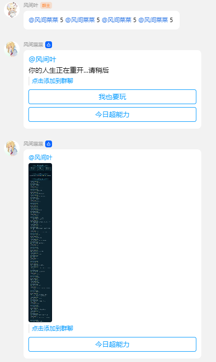

# 人生重开模拟器

## 介绍

人生重开模拟器

## 指令

| 指令    | 用途     | 示例      | 备注 |
| ------- | -------- | --------- | ---- |
| remake  | 开始游戏 | #人生重开 |      |
| 0 1 2   | 选择天赋 | 0 1 2     |      |
| 5 5 5 5 | 分配属性 | 5 5 5 5   |      |
| 随机    | 随机分配 | 随机      |      |

## 注意事项

如果有的话

## 配置文件

如果有的话

## 鸣谢

- [VickScarlet/lifeRestart](https://github.com/VickScarlet/lifeRestart) 人生重开本体
- [noneplugin/nonebot-plugin-remake](https://github.com/noneplugin/nonebot-plugin-remake) 人生重开结果图片

## 效果图

### 开始游戏

### 选择天赋

### 分配属性

